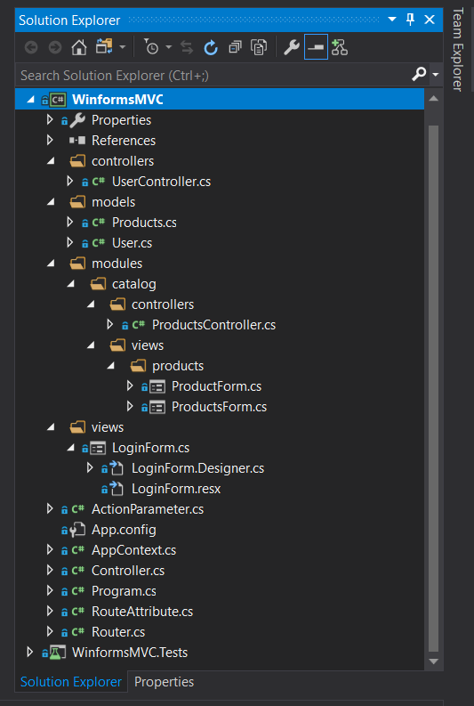

Implementation MVC template for application based on Windows Forms 
==================

This is an application prototype.
I haven't found a realization that I liked, so I decided to invent my own bike.

**Structure the application.**

The application has a modular and flexible structure.
For example:



**Controllers and Action access**

```csharp
namespace WinFormsMVC.controllers
{
    // Controller - any class with attribure Route, all classes scan by router 
    [Route(Route = "path/to/controler")] //or [Route("path/to/controler")]
    class UserController : Controller
    {
        //Action a method ends "Action" can receive many arguments of ActionParameter type
        //calling the action  Router.Run("path/to/controler/index");
        public void IndexAction() // action 
        {
            //TODO something
        }

        //classes ObjectParameters1 and ObjectParameters2 extended from ActionParameter class
        //calling the action  AnyType obj = Router.Run("path/to/controler/create", parameters1, parameters2, ...);
        public AnyType CreateAction(ObjectParameters1 parameters1, ObjectParameters2 parameters2, ...)
        {
            return AnyType;
        }
       ....
    }
}
```

**Views**

Views - Windows forms. 
 
```csharp
// caling controller action from view
private void Update_Click(object sender, EventArgs e)
{
    ProductParameters productParameters = new ProductParameters();
    
    // call UpdateAction in controller 
    if ((bool)Router.Run("catalog/products/update", productParameters)) {
        this.Close();
    }
}
```

```csharp
// injecting data into a view (Windows Form) - Property Injection
public void UpdateAction(ProductParameters parameter)
{
    ProductForm form = new ProductForm();
    form.productParameters = parameter;
    form.Show();
}
```
